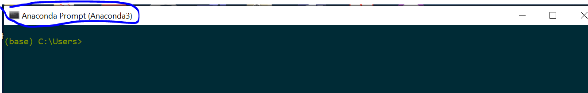
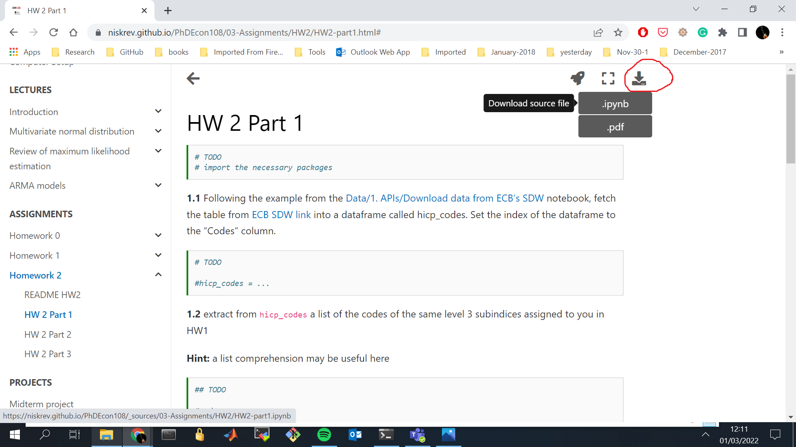

# HOW TO's

## Open a `jupyterlab` notebook in a directory of your choice

$$\alpha$$

(1) start an Anaconda Prompt (or a Windows terminal if it has been successfully setup to work with anaconda)

(2) find and copy the path of the target directory 

(3) type `cd` in the anaconda prompt and paste the path you copied (either press `ctrl + v` or right-click of the mouse). Press `enter`

(3) type `ls -l` to see the content of the directory you are currently in, and to confirm  that it is where you want to start `jupyterlab`. After that, type `jupyter lab`

## Shutting down 
After saving all open notebooks, press `control + c` in the terminal where the jupyter lab was started

## Download a notebook from [https://niskrev.github.io/PhDEcon108/](https://niskrev.github.io/PhDEcon108/)

